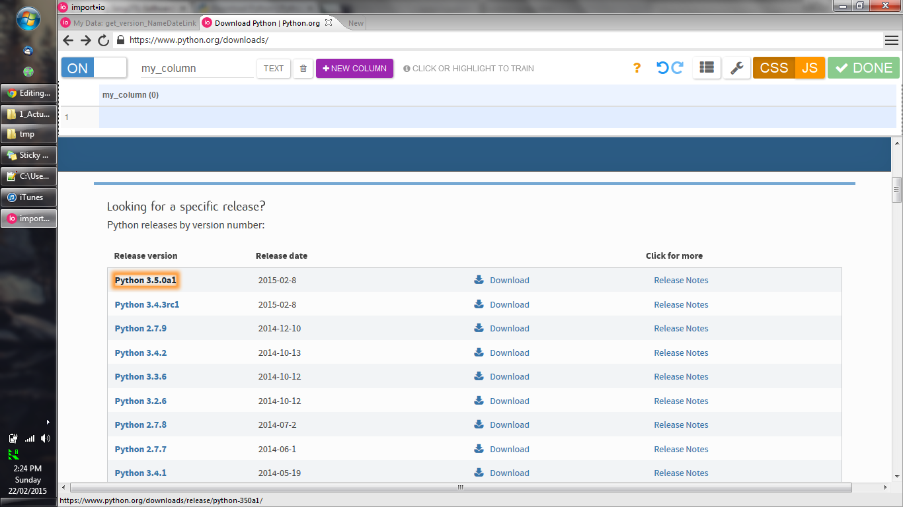

# Script 1 Version 2 - Import.io Script creation instructions

1) Register for and download [Import.io](https://import.io/).

2) Create a new EXTRACTOR (see FOOTNOTE 1).

3) Navigate to <i>https://www.python.org/downloads/</i> within the application and turn extraction "on." The page will reload.

4) Hover over (auto-highlight) the first column/row entry in the Python download information table 

5) Select the "many rows" option in the alert box that appears.

6) Confirm every version appears in the data table above the webpage; add a new column and select the hover/auto-highlight the first row entry (date) in the second column 

7) Confirm every version has it's associated date in the table above; Repeat process to collect download URL data: create a new column, hover/auto-highlight first download link.

8) Confirm all download links are now in the table.

9) Press green "DONE" button in the upper right.

10) Name your API and press "Publish" to save the extracted data to your application.

* [FOOTNOTE 1] I first tried to create a CRAWLER so that I could parse each URL, visit each URL, then collect the neccesary file download size from each page. Each page however, was formatted slightly different, and I couldn't train my import.io script for every variation.