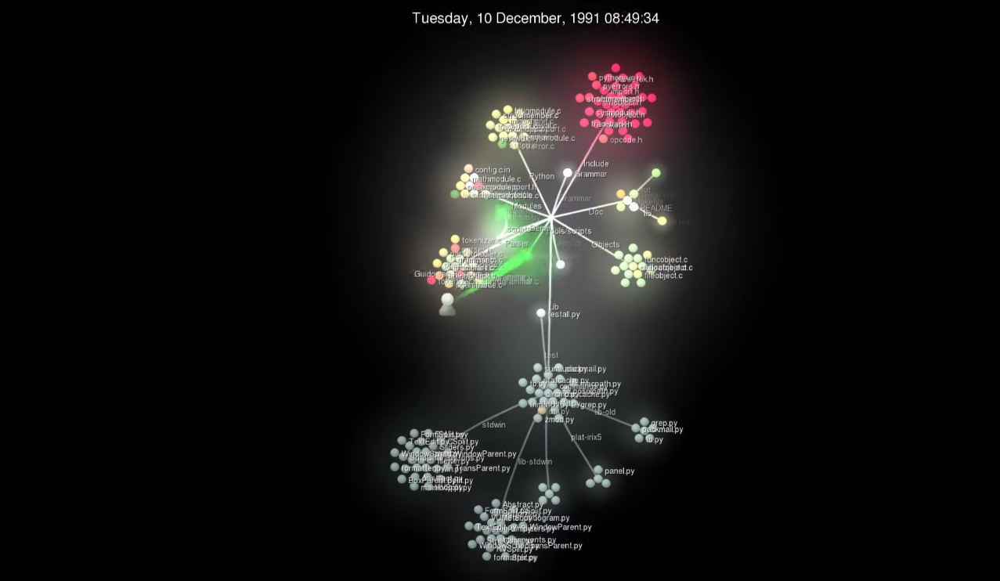
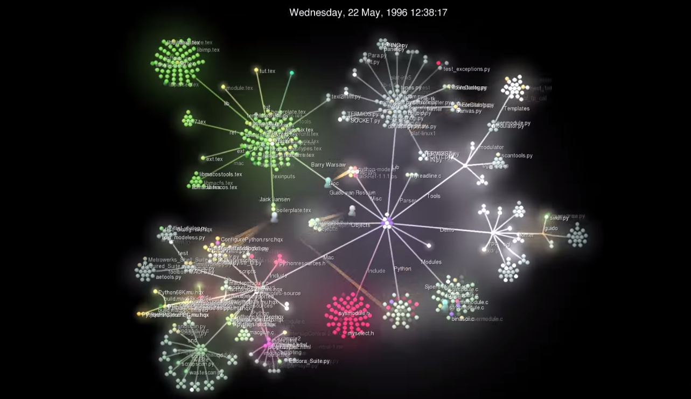
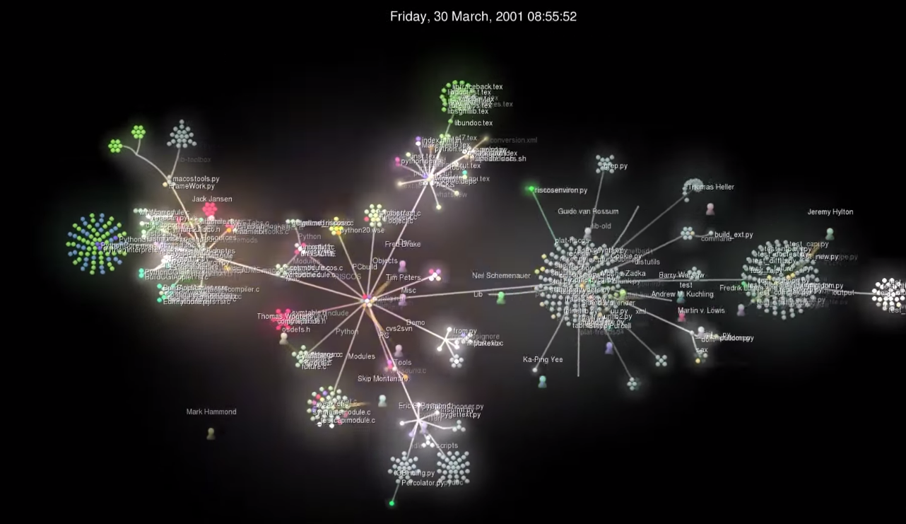
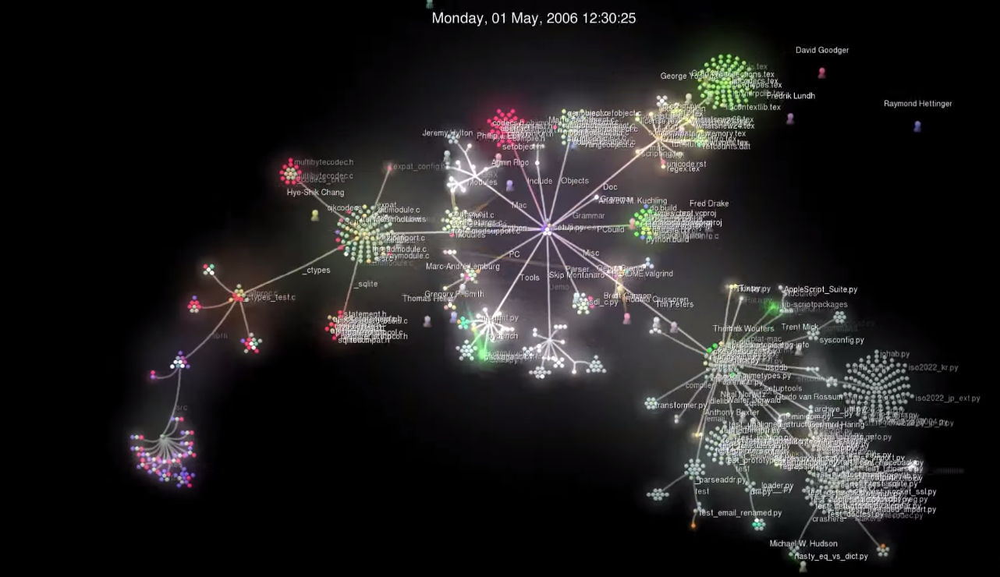
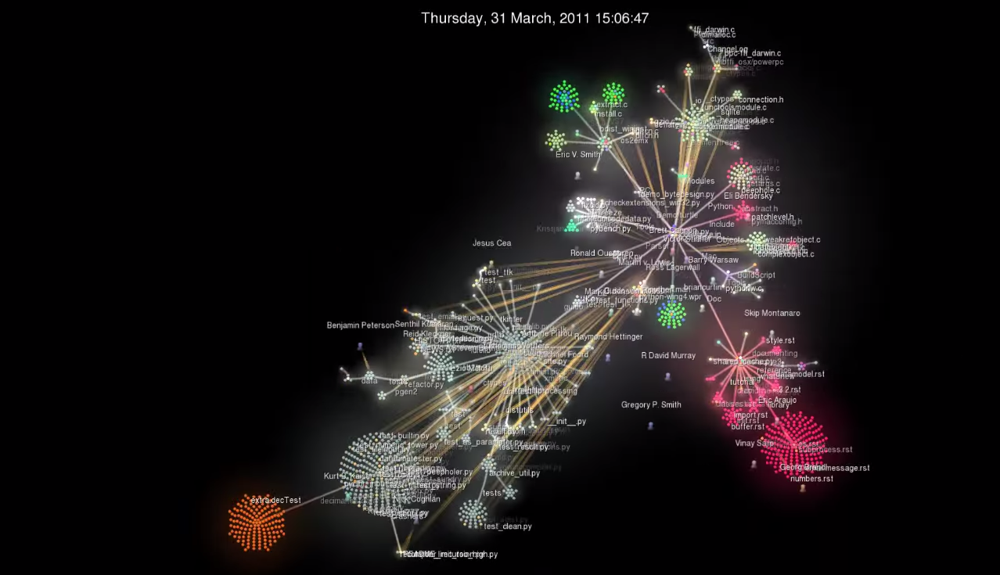
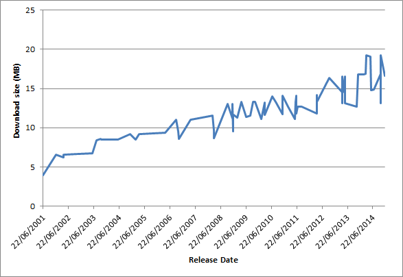
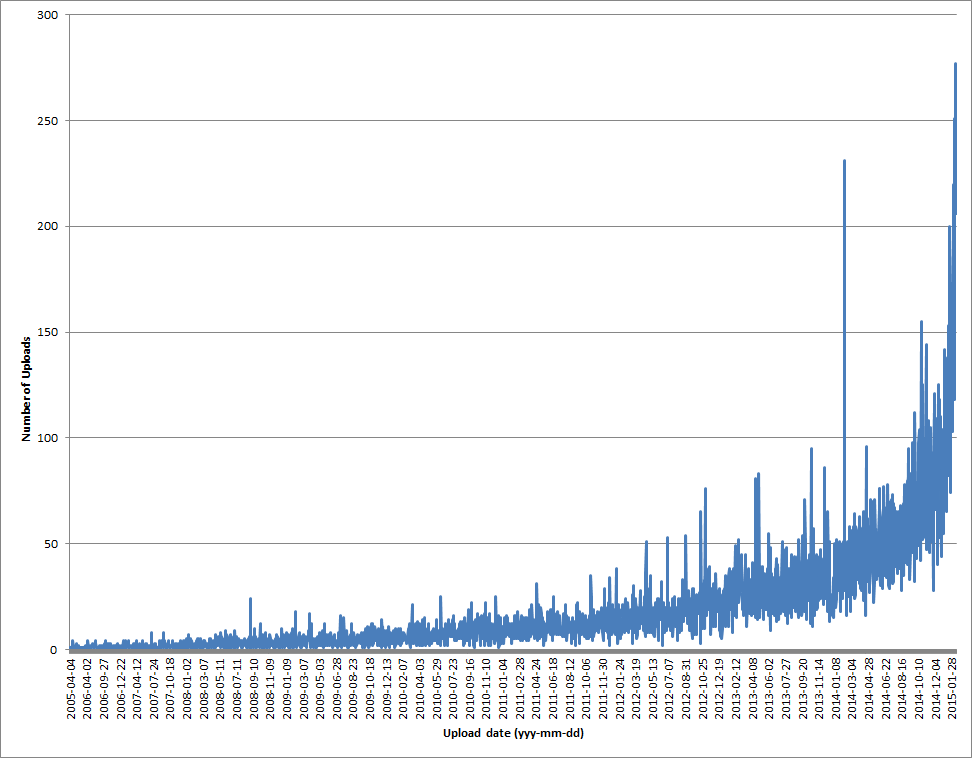
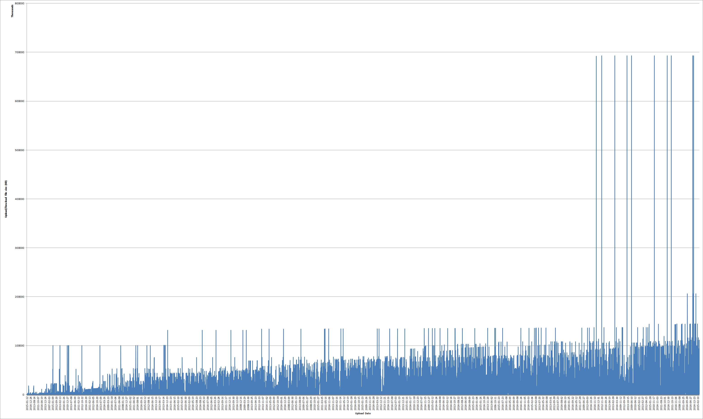

# Methodology 1
# Complexity of the Python Language

First, a brief history of Python. After all, every evolution project has to start somewhere.

Python was conceived of in the late 1980's. Named after Monty Python, implementation was started in in 1989 by Guido Van Rossum (Benevolent Dictator for Life {BDFL}). It was being developed at the same time as many other languages, such as Ruby and Perl, who were also gaining popularity. Rossum was implementing the ABC (interpreted) language, and while learning lots about language design, had a number of "Gripes" with ABC. He liked a few things about it, especially its extensibility, but he still wanted something else. Furthermore, he wanted a better way to access system Kernels and other system administration tasks then the current processes of writing C programs or shell scripts. With all of that, Python was born.

Python was first posted in USENET in February 2001 but, the first major version (1.0) in January 1994, but the most signifcant advances were released in version 2.0 on 16 October 2000, with major features such as garbage collection and support for unicode. This release also included a shift to a transparent, community-backed process. Currently, there are 73 versions available for download. While viewed as a "scripting language," Python has been realized as a general-purpose programming language.

Python's transparency means that its core code really has two major components: 1) The ACUTAL core as officially developed by Rossum's team and his succesors, and 2) its packages developed by the community. These packages can be easily installed as-needed onto a machine via <i>Pip</i> or <i>easy install</i>, and imported into a project using keyword <i>import</i>.

In terms of this project, this methodology took the most time to complete, but also yieled the most significant data showing Python's evolution. It's split into two parts: A - Python Core/Source code and B - Python Packages.

For more information about Python's hisotry, check out the links below:

[Guido Van Rossum's Blog - "A brief timeline of Python"](http://python-history.blogspot.ca/2009/01/brief-timeline-of-python.html)

[Guido Van Rossum's Blog - "Introduction and Overview"](http://python-history.blogspot.ca/2009/01/introduction-and-overview.html)

[General Python FAQ](https://docs.python.org/2/faq/general.html#why-was-python-created-in-the-first-place)

[The Zen of Python](https://www.python.org/dev/peps/pep-0020/)

The rest is up to you to find out. The point of this project is to find some interesting information, so let's get started.

----------------------

PART A - Steps for inspecting the Python Source code
----------------------

1.0 VISUALIZATION

1.1. View Gource video visualizing the commits to the Python source code over time; save some benchmark screenshots
    
1.2. Infer some interesting information about the evolution of Python's structure such as the addition (or removal) of a significant modules, how constantly changes have been made, and trends such as number of developers, files added, etc., etc.

2.0 STATISTICS

2.1. Visit the Python's downloads page (lists a link to every version)
    
2.2. <b>Create a script</b> to parse each version name, upload date, and size of downloadable file

2.3. Visualize the version date vs size via graphs; infer useful information
  
Metrics: Time, Number of uploads, Size of Download files
  
  

PART B - Steps for inspecting the Python Package index
----------------------

1. Visit the [Python Package Index](https://pypi.python.org/pypi); investigate the number of packages available

2. <b>Create a script</b> to parse each package name, upload date(s), download size(s)
  
3. Analyze and visualize data and infer useful results.  

Metrics: Number of Packages, number of upload dates, number of uploads per date, sizes of package downloads

----------------------

Sources and generated Raw Files
----------------------

<b>Part A</b>

[Gource Video - Evolution of Python](https://www.youtube.com/watch?v=cNBtDstOTmA)

[Script 1: Source Download Date_Size parser](./1_ActualSource/downloadSizeParser.py)

<b>Script 1 Run instructions</b>: Getting Python release information via Selenium

1) Compile and Execute: <i>python downloadSizeParser.py</i>

2) View returned data: Number of Python versions currently available for download, and full URL of every Python version download page.

<b>NOTE:</b> This script was my first attempt at trying to get all Python download version names, urls, and download sizes. Not only was Selenium difficult to work with, and slow to execute (had to physically open firefox window), I realized it wouldn't be able to handle the different formatting of nearly <i>every</i> Python download page. Some pages were rich webpages with tables, others were simple and with only part of the information, and others were bascially simple text files.

Because of this, I switched to Import.io to gather information for this part. Given that this was a new tool for me to learn, I've included information here on how I created my extraction script.

<b>Script 1 (Version 2) Creation instructions:</b>

1) Register for and download [Import.io](https://import.io/)

2) Create a new extractor (see FOOTNOTE 1)

3) Navigate to <i>https://www.python.org/downloads/</i> within the application and turn extraction "on." The page will reload.

4) Hover over (auto-highlight) the first column/row entry in the Python download information table [Image 1](LINK)

5) Select the "many rows" option in the alert box that appears

6) Confirm every version appears in the data table above the webpage; add a new column and select the hover/auto-highlight the first row entry (date) in the second column [Image 2](LINK)

7) Confirm every version has it's associated date in the table above; Repeat process to collect download URL data: create a new column, hover/auto-highlight first download link.

8) Confirm all download links are now in the table.

9) Press green "DONE" button in the upper right

10) Name your API and press "Publish" to save the extracted data to your application

<b>Script 1 (Version 2): Run instructions</b>

1) From your application screen, open your API. Click "Query" to run the API and collect the most recent information.

2) Click "GET API", "TSV", and finally, "download as CSV" so that you can use the data in an excel spreadsheet (useful data: Number, version, release date).

NOTE: At this point I had two options - attempt to create several scripts to handle every unique variation of the Python version download pages (same problem as before), or manually visit each page and collect the file download size, then include it in the excel file. Due to time limitations, I chose the latter.

3) Visit each URL parsed from script 1, verision 1, and get the size of the <i>GZipped source tarball</i> download (bytes). Add to the excel file.

13) Highlight the "Release Date" and your file size columns. From the main menu, go to <i>Insert > Chart > Line</i> to create a graph of the numerical results [Image 3](LINK).

[FOOTNOTE 2] I first tried to create a crawler so that I could parse each URL, visit each URL, then collect the neccesary file download size from each page. Each page however, was formatted slightly different, and I couldn't train my import.io script for every variation.

----------------

<b>Part B</b>

[Script 2: Scrapy web crawler to get Python Package information](./2_PythonPackages/dmoz_spider.py)

[Script 2: Compiled python file](./2_PythonPackages/dmoz_spider.pyc)

[Scrapy-generated 'resources' file](./2_PythonPackages/Resources)

* Script 2 Run instructions: getting Python packages information

1) Merp merp merp.

2) Herp herpa derp

3) Run command BLAH produces raw file: [items.json](./2_PythonPackages/Raw/items.json)

[Script 3: JSON handler - process information from script 2 into text output useable in excel](./2_PythonPackages/jsonHandler.py)

* Script 3 Run instructions:

1) Merp merp merp.

2) Herp herpa derp

3) THIS produces raw text output of dates and sizes: 
[Package_dateVSsize](./2_PythonPackages/Raw/printOut_dateSizes.txt)

4) THIS produces raw text output of number of uploads on each unique dates: 
[Package_dateVSnumTimes](./2_PythonPackages/Raw/printOut_dateTimes.txt)

5) THIS produces text output of most and least common upload dates: 
[Package_dateVSsize](./2_PythonPackages/Raw/printOut_leastMostCommon.txt)

[Excel file 1: Tabularized data of download date and size of download](./2_PythonPackages/Raw_Processed/dates_downloadSizes.xlsx)

[Excel file 2: Tabularized data of TOTAL package upload sizes per unique date](./2_PythonPackages/Raw_Processed/dates_downloads.xlsx)

----------------------

Results
----------------------

Texty text text

<b>Part A</b>

GROUP 1 - RESULTS OF GOURCE VISUALIZATION

Here i've include some benchmark screenshots (every 5 years) of the Gource video depicting the committed changes of Python. You can see how the number and locations of files, as well as the number of developers increase.

Figure 1: Python file structure in 1991; year 0

Figure 1: Python file structure in 1996; year 5

Figure 1: Python file structure in 2001; year 10

Figure 1: Python file structure in 2006; year 15

Figure 1: Python file structure in 2011; year 20

DISCUSSION OF THE GOURCE SCREENSHOTS

----------------

GROUP 2 - RESULTS OF WEB SCRAPERS

TEXT TEXT: Trend graph: Python releases (dates) vs size of download - inreasing complexity?

Graph 1: Trend graph of Python core source code download sizes

<b>Part B</b>

TEXT: Number of uploads per unique date

Graph 2: placeholder

TEXT: Sizes of total uploads per unique date

Graph 3: placeholder

Discussion and Analysis
----------------------

<b>Part A</b>

Texty text text

<b>Part B</b>

The PyPi website was not build for data analysis and is largely disorganized for efficient research - it is build for finding the package you need (based on name) as quickly as possible.

Tools
----------------------
  
* Gource/Youtube

* Import.io

* Scrapy
 
* Selenium

* Excel (tabularizing and graphing)
  

 
Obstacles
----------------------

<b>Part A</b>

If I had more time, I could have attempted to make a scraper to get details about each new version/major release from Python's documentation pages (such as number of fixes, what's changed...). 

Unfortunatley, not only does each release document not contain the same information (number of fixes), every download page and subsquent documentation was formatted slightly differently than the other. I wasn't able to make a script to consistently handle the information on each unique page within the time frame of this project. As such, I only skimmed the surface of the available information.

Another issue was that not every download page provided the same download file type. While some pages offered gzipped source tarballs, xz compressed tarballs, and executable installers, others included <i>only</i> the gzipped source tarball. This limited my information source to one file size only. Furthermore, if two pages offered the same types and number of downloads, they may have been ordered differently in the same table, meaning I couldn't just parse the first entry in every table. While this was a trivial issue to fix, it did require more testing to confirm I had the right data.

A final issue with parsing Python source files was the fact that some pages (usually older) didn't include the download link directly there, and instead advised users to visit a different page, which then included all relevant information. I could have created a more in-depth script to handle this situation but again, the time constraint of this project forced me to visit each page manually, find the correct information display, and run the script from there. 

For future work, I could try to sort the information based on release type, major N.X or minor N.N.X. This would have sorted my data points a little better, and may be the reason why my trend graph is so spiky - minor releases tend to be smaller in size, while major releases include several new developments and restructures.

<b>Part B</b>

The detailed information about each package was not in the format I expected. I thought the table on each page was a history of versions available for that package, similar to how the Python source download page was set up in Part A. My original intention was to map the changes in a few of the most popular packages to show how they have contributed more to Python over time, thus contributing to the overall evolution of the lanugage.

-------------------

Future work
-------------

Texty text text
