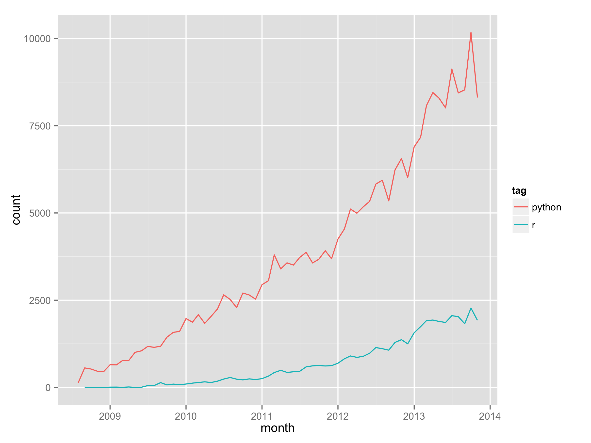
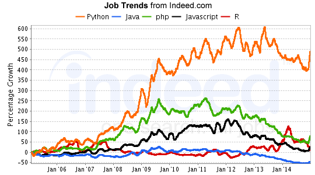
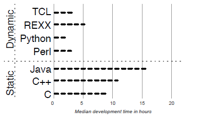

# Methodology 2
# Evolution of projects supported by Python

Methodolgy two intends to examine the evolution of code bases/projects supported by Python. 

My original intention was to search GitHub and SourceForge for two medium-sized programs that accomplished the same task. I 
intended to parse some information such as lines of code (LOC), use Gource to compare the structure of the projects, and 
gather other source-file metrics and attempt to extrapolate some useful data. However, I realized that this information would
not contribute any insight into the evolution of Python, but simply just compare one language against another.

As such, I shifted my search into trying to find how the number of Python projects over time and the types of projects
developed over time. Unable to find resources to parse significant hard data from, I researched blog posts and trend graphs 
about the use of Python. 

----------

Steps
-----

1) Compare two programs in C and Python to determine some key statistical differences between the two; establish why Python is popular to learn and use

2) Read some Python success stories and other Python documentation to determine what kind of projects have been supported using Python

3) Read blog posts and collect graphs to prove increased use of Python over time

----------

Sources
-------

[Python success stories](https://www.python.org/about/success/)

[Hello World - Python source file](./Source/Hello_World.py)

[Hello World - C source file](./Source/HelloWorld.c)

[Hello World - C object file](./Source/HelloWorld.o)

[Hello World - C executable file](./Source/HelloWorld.exe)

[Timing script](./Source/time_HelloWord.bat)

----------

Results
----------

Texty text text

Graph 1: The number of stack overflow tags of Python, R vs time

Graph 2: Trend graph depicting employer demand of web languages

Graph 3: Model of project development time per language

----------

Discussion and Analysis
-----------------------

Texty text text

----------

Tools
-------

Texty text text

----------

Obstacles
----------

Texty text text

----------

Future Work
----------

Texty text text
